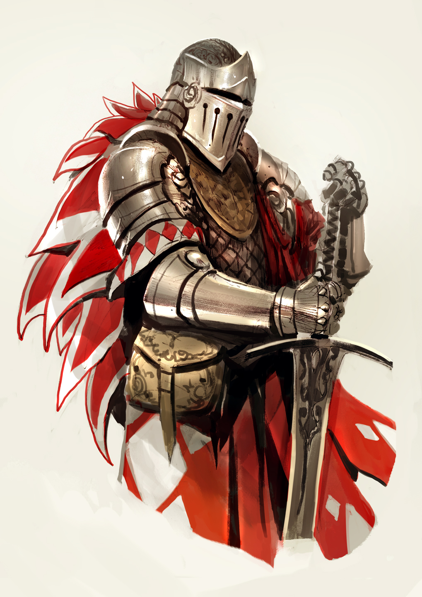

# Rolando, experto en lucha y hechicería    
Para esta primera entrega, vamos a modelar a Rolando, el protagonista de un juego de rol de Lucha y Hechicería, ambientado en la época medieval.

Se requiere, para la fecha estipulada, la entrega del código Wollok, incluyendo todos los tests necesarios para cada requerimiento de cada punto, subido al repositorio indicado.

## Entrega 1 

### Punto 1: Hechicería
El nivel de hechicería de rolando se calcula como un valor base, que es 3, por el poder de su hechizo preferido. A todo eso, se le suma el valor de la fuerza oscura.

Entonces:

	*nivel de hechicería = (valor base * el poder del hechizo preferido)+ valor de la fuerza oscura*

Donde: 

Los hechizos pueden ser:
- Espectro maléfico: su poder viene de la cantidad de letras de su nombre (17). Como es mayor a 15, entonces el hechizo es poderoso 
- Hechizo básico: su poder es de 10 y no es poderoso
El valor de la fuerza oscura es un cálculo global que afecta a todos (incluído Rolando). Por ahora, la fuerza oscura tiene valor 5, pero puede cambiar a lo largo del tiempo ante determinados sucesos que pasen en el mundo

**Requerimientos:**
1. Obtener el nivel de hechicería de rolando
2. Tener la posibilidad de que el espectro maléfico cambie de nombre.
3. Cambiar el hechizo preferido de Rolando en cualquier momento
4. Representar un eclipse, lo que provoca que la fuerza de la oscuridad se duplique
5. Saber si Rolando se cree poderoso, lo cual es cierto si su hechizo preferido lo es.

### Punto 2: Lucha 
La habilidad para la lucha de Rolando es un número que se debe calcular como un valor base que comienza en 1 al que se le suma lo que aportan todos los artefactos que posea, que pueden ser los siguientes:

- Espada del destino: Aporta 3 unidades de lucha. 
- Collar divino: Suma tantas unidades de lucha como perlas tenga.
- Máscara oscura: Da la mitad de unidades de la fuerza de la oscuridad, pero nunca menos de 4 unidades (es decir que con la fuerza de la oscuridad inicial son 4, pero si hubiera un eclipse pasarían a ser 5)

**Requerimientos:**
1. Modificar a gusto el valor base de lucha de Rolando
2. Agregar y remover artefactos de Rolando
3. Saber el valor de lucha de Rolando
4. Averiguar si Rolando tiene mayor habilidad de lucha que nivel de hechicería

### Punto 3: Lucha avanzada
En este punto se irán sumando nuevos elementos, que tienen que funcionar al mismo tiempo que los anteriores siguen funcionando.

**ARMADURA**

Rolando puede que entre sus pertenencias tenga una armadura, lo que también aumenta su habilidad para la lucha, sumándose a lo anteriormente explicado. El valor que aporta la armadura es de 2 unidades más el valor del refuerzo. Solo puede tener un refuerzo a la vez. Estos son los refuerzos posibles:
- Cota de malla: suma 1 unidad de lucha
- Bendición: suma tantas unidades de lucha como nivel de hechicería obtenga quien posee la armadura.
- Hechizo: puede ser el espectro maléfico o el hechizo básico. En cualquier caso, aumentan la habilidad de lucha lo mismo que su poder de hechicería. 
- Ninguno: Si no tuviera refuerzo, no suma nada a la armadura, por lo que en definitiva la armadura otorga las 2 unidades originales. 

**ESPEJO**

Rolando también puede poseer al Espejo fantástico: El espejo fantástico se comporta de la misma manera que la mejor de sus restantes pertenencias. Se considera la mejor pertenencia a la que aporta más puntos de lucha. Si sólo tuviera como pertenencia al espejo fantástico, su aporte a la lucha sería nulo.

**LIBRO DE HECHIZOS**

Por otra parte, puede suceder que Rolando en vez de tener un simple hechizo preferido, adopte como preferido un libro de hechizos, en el que están detallados varios hechizos. En este caso, el poder de hechicería que aporta es la sumatoria del poder de todos los hechizos poderosos que contenga.

**Requerimiento:** 

Modelar los nuevos elementos y que todo lo anterior siga funcionando correctamente.
Además:
1. Saber si Rolando está cargado. Eso significa que tiene mas de 5 elementos. Cómo harías para probarlo?
2. ¿Qué sucede si el libro de hechizos incluye como hechizo al mismo libro de hechizos?

